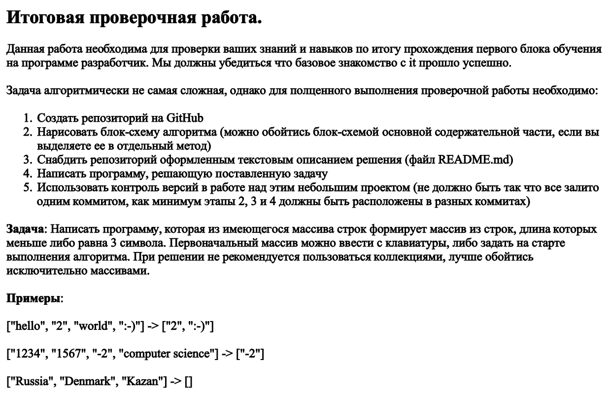
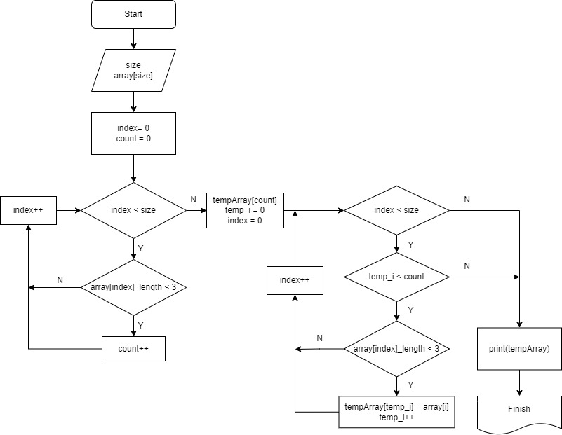

# Итоговая работа первой четверти #
## Задание ##

## Создание алгоритма ##
На этом этапе создается алгоритм основного метода

**После получилось на словах так:**
* Пользователь задает размер массива и вводит каждую строку 
* Добавляем их в заданный массив
* Циклом проходим по массиву в поисках кол-ва строк с символами меньше или равно 3
* Создаем новый массив размером в это количество
* Циклом записываем туда нужные элементы из исходного массива 
* Выводим получившийся массив на экран

## Написание программы ##
На этом этапе пришлось пришлось добавить в основной алгоритм некоторые изменения связанные с выводом данных... А именно:
* добавить условие на проверку отсутствия символов меньше трёх
* создать дополнительный "пустой" массив для вывода "[]", как прописано в задании

При написании кода руководствовался программой обучения, но пару раз прибегнул к поиску
Например:
* автоматическое убирание пробела при вводе строки в массив *
* обрамление массива "[{0}]"
* *условие на ввод пустой строки придумал сам)*

*P.S. если бы не условие сформировать новый массив, то все было бы гораздо проще)*

## Обратная связь ##
**На самом деле времени пришлось потратить уйму, чтобы вспомнить и соединить полученные знания, поэтому буду рад комментариям и замечаниям со стороны преподавателей и ревьюверов!**